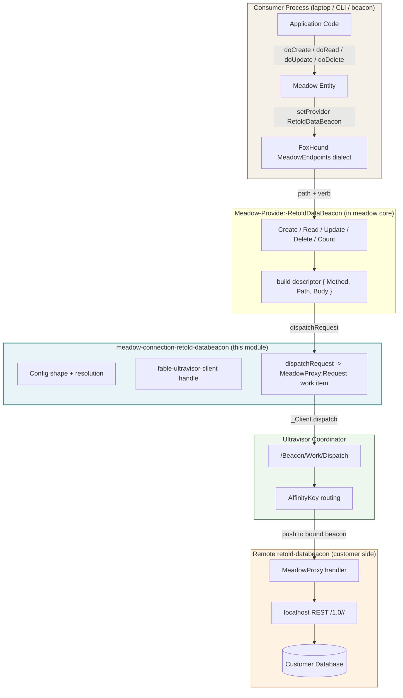
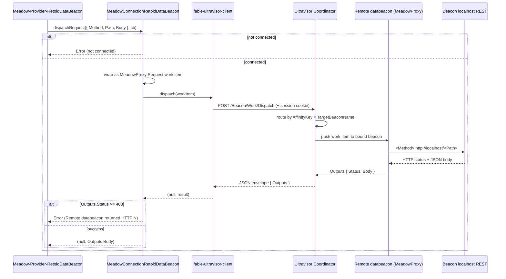
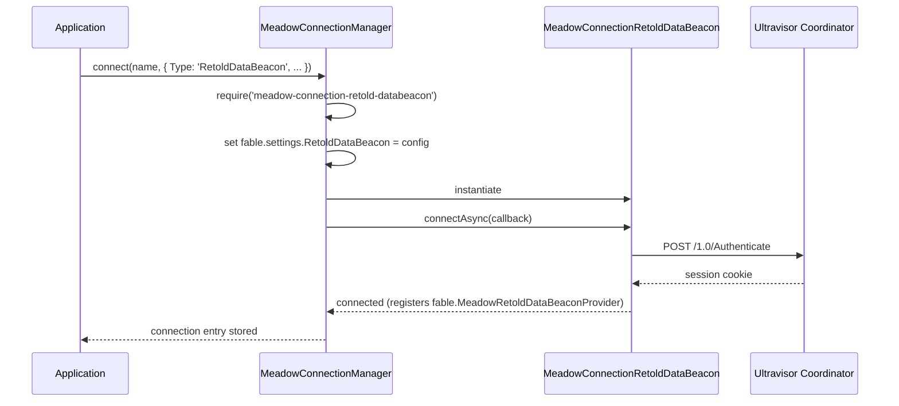

# Architecture

Meadow Connection Retold DataBeacon relays meadow CRUD and introspection to a remote retold-databeacon agent across an Ultravisor mesh. This page documents the relay design, the split of responsibilities between this module and the meadow core provider, the `MeadowProxy:Request` dispatch flow, AffinityKey routing, and how the connection loads through meadow-connection-manager.

---

## The Relay Split

The defining fact of this module: it does **not** build the meadow CRUD HTTP requests. That work lives in the meadow core provider `Meadow-Provider-RetoldDataBeacon`. This module is the connection-manager-shaped wrapper that surrounds the provider with an Ultravisor client, configuration, and the dispatch transport.



The two halves of the relay communicate through `fable.MeadowRetoldDataBeaconProvider`. On a successful connect this module sets that property to itself, and the provider reads it to find the live transport. When the provider has a descriptor to send, it calls `this.dispatchRequest({ Method, Path, Body }, cb)` and parses the JSON string that comes back.

---

## Component Responsibilities

### MeadowConnectionRetoldDataBeacon (this module)

The connection class, extending `FableServiceProviderBase`:

- **Construction** -- resolves config from constructor options layered over `fable.settings.RetoldDataBeacon` over defaults: `UltravisorURL`, `TargetBeaconName`, `TargetConnectionHash`, `UserName`, `Password`, `TimeoutMs` (default `30000`). The Ultravisor client is built lazily on connect, not in the constructor.
- **Connect** -- `connectAsync()` validates the three required keys, constructs a `fable-ultravisor-client` with the URL and credentials, authenticates against the coordinator, marks `connected = true`, and registers itself on `fable.MeadowRetoldDataBeaconProvider`. `connect()` is a sync shim that calls `connectAsync()` with no callback.
- **Dispatch transport** -- `dispatchRequest({ Method, Path, Body }, cb)` wraps the descriptor as a `MeadowProxy:Request` work item and dispatches it. `_dispatchAction()` is the internal helper for the introspection calls.
- **Introspection** -- `listTables()`, `introspectTableSchema()`, and `introspectDatabaseSchema()` delegate to the remote beacon's data-access and management capabilities.
- **Lifecycle** -- `close()` clears `connected`, drops the client, and unregisters the singleton.
- **Schema parity stubs** -- `createTable()` / `createTables()` call back with a "not supported on remote connections" error; `generateCreateTableStatement()` / `generateDropTableStatement()` return an empty string. Remote databases handle their own DDL.

### Meadow-Provider-RetoldDataBeacon (meadow core)

The request builder this connection feeds, living in the `meadow` package under `source/providers/`:

- Looks up `fable.MeadowRetoldDataBeaconProvider` for the live connection; errors if none is registered.
- Reuses the FoxHound `MeadowEndpoints` dialect to build the relative route from the query, then prefixes it with the connection hash to form `/1.0/<TargetConnectionHash>/<Entity>` (reading `_TargetConnectionHash` off the connection).
- Implements `Create`, `Read`, `Update`, `Delete`, and `Count`. For `POST` / `PUT` it serializes the first query record as the body. It calls `dispatchRequest`, parses the returned JSON string, and reshapes the result to match meadow's expectations (unwrapping the identity column on create, wrapping a singular read as an array, extracting `Count`, and so on).

> The exact reshaping behaviors are owned by the provider in the `meadow` package, not by this module. This module only moves a `{ Method, Path, Body }` descriptor across the mesh and returns the response body string.

---

## The Dispatch Flow

`dispatchRequest` is the heart of the transport. It turns the provider's descriptor into a coordinator work item and unwraps the beacon's response.



### The Work Item

`dispatchRequest` builds exactly this shape and hands it to the client's `dispatch`:

```javascript
let tmpWorkItem =
	{
		Capability: 'MeadowProxy',
		Action: 'Request',
		Settings:
		{
			Method: pRequest.Method || 'GET',
			Path: pRequest.Path || '',
			Body: pRequest.Body || '',
			RemoteUser: this._UserName || ''
		},
		AffinityKey: this._TargetBeaconName,
		TimeoutMs: this._TimeoutMs
	};
```

`Method`, `Path`, and `Body` come straight from the provider's descriptor. `RemoteUser` carries the configured `UserName` so the remote beacon can attribute the request. `AffinityKey` is the `TargetBeaconName`, and `TimeoutMs` is the configured per-request timeout.

### Unwrapping the Response

The coordinator returns the beacon handler's result. This module reads `result.Outputs` (tolerating a bare result object if `Outputs` is absent) and pulls `Status` and `Body` from it:

- If `Status` is a number `>= 400`, `dispatchRequest` calls back with an `Error` quoting the status and the first 200 characters of the body.
- Otherwise it calls back with `(null, Body)` -- the raw response body **string**. The provider is responsible for `JSON.parse`-ing it.

---

## AffinityKey Routing

Ultravisor is a beacon coordinator: remote agents (beacons) connect to it and advertise capabilities, and clients dispatch work items that the coordinator routes to a beacon. An **AffinityKey** pins a stream of work items to a particular beacon.

This module sets `AffinityKey = TargetBeaconName` on every dispatch -- both the `MeadowProxy:Request` items and the introspection items. The effect:

- All traffic for one customer beacon shares a single, stable affinity key.
- The coordinator binds that key to whichever registered beacon serves it. When each customer has exactly one databeacon registered, the binding is deterministic -- every request for `customer-acme-prod` lands on the same beacon.
- Because the key is stable, a multi-step interaction (read, then update, then re-read) all reaches the same remote agent and the same underlying database.

> The exact affinity binding semantics (first-claim, sticky, rebinding on disconnect) are owned by the [Ultravisor](https://stevenvelozo.github.io/ultravisor/) coordinator, not by this module. From the connection's side, the contract is simply: a stable `AffinityKey` routes a stable stream of work to one beacon.

---

## The Coordinator Transport

The dispatch transport is owned by [fable-ultravisor-client](https://fable-retold.github.io/fable-ultravisor-client/). This module uses two of its methods:

| Step | Client method | HTTP |
|------|---------------|------|
| Connect | `authenticate(cb)` | `POST /1.0/Authenticate` -- captures the session cookie |
| Dispatch | `dispatch(workItem, cb)` | `POST /Beacon/Work/Dispatch` -- carries the cookie, returns the JSON envelope |

The client captures the session cookie from the authenticate response and attaches it to every later dispatch, so the coordinator's session middleware accepts the request. The client also bounds the dispatch socket with `TimeoutMs` so a stuck remote does not hang the caller indefinitely.

---

## Loading Through the Connection Manager

`meadow-connection-manager` is the registry that maps a `Type` string to a connection module. The relevant entry for this module:

- **Module map:** `'RetoldDataBeacon'` -> `'meadow-connection-retold-databeacon'`



When the manager runs `testConnection`, this type is treated as **already probed** -- the authenticate handshake during connect is itself the connectivity check, so no extra round-trip probe is issued (unlike lazy-pool SQL drivers, which need a `SELECT 1`).

The manager has **no form-schema entry** for `RetoldDataBeacon` (the manager source notes the schema is "not yet defined"), so `getProviderFormSchema('RetoldDataBeacon')` returns `null`. A connection UI must build the config form by hand until a schema is added.

---

## Singleton Transport Note

This module registers itself on `fable.MeadowRetoldDataBeaconProvider` on connect, and the meadow provider reads exactly that one property. If two `RetoldDataBeacon` connections coexist in the same process, the later connect **overwrites** the earlier registration -- only one transport is reachable at a time. The module's source documents this as an accepted limitation for the v1 engineer-laptop scenario.

---

## Comparison with Other Connectors

| Aspect | RetoldDataBeacon | MeadowEndpoints | MySQL |
|--------|------------------|-----------------|-------|
| Backend | Remote beacon via Ultravisor | Remote REST API | MySQL server |
| Transport | Ultravisor dispatch (`MeadowProxy:Request`) | HTTP (`simple-get`) | mysql2 pool (TCP) |
| Makes its own requests | No -- provider builds the descriptor, this module dispatches it | No -- provider does | Yes (pool) |
| Routing | AffinityKey = `TargetBeaconName` | Direct URL | Direct host:port |
| DDL generation | No (remote DB owns schema) | No (upstream owns schema) | Yes |
| Auth at connect | Yes (coordinator session cookie) | Yes (session cookie) | DB credentials |
| `testConnection` probe | Skipped (handshake = probe) | Skipped (Authenticate = probe) | `SELECT 1` |

The closest sibling in shape is the [meadow-endpoints connection](https://fable-retold.github.io/meadow-connection-meadow-endpoints/): both are relay wrappers whose paired meadow provider builds the request, and both skip the manager's connectivity probe because connecting is itself the check. The difference is the transport -- this module sends each request as a coordinator work item routed by AffinityKey, rather than over a direct HTTP socket.
